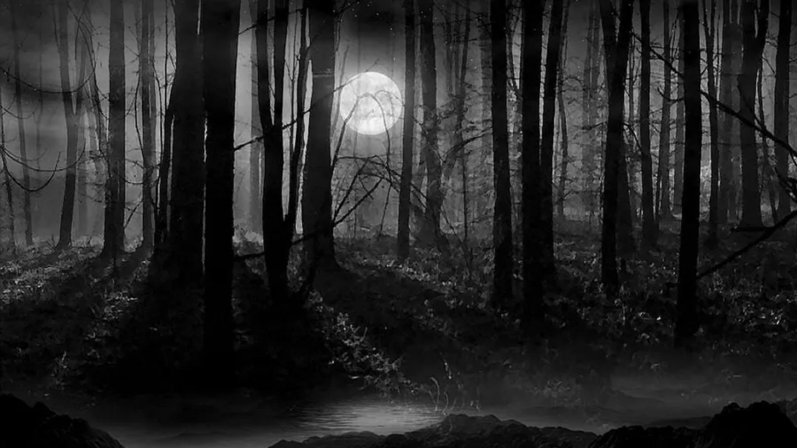
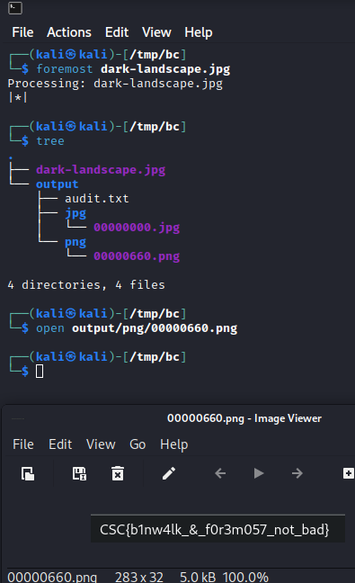
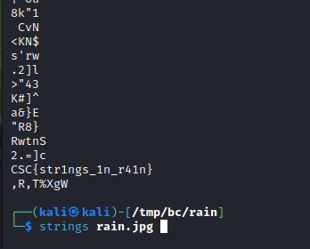

# Stegnograhpy and Basic Info

# Basic info

Before we start, there are some very basic stuff that might help in solving CTF challenges.

Frist of all, text encoding. Text (or data in general) can be encoded in many common ways. Knowing and making your eyes get used to those can help you find flags faster, or at least know what you're dealing with. I'm not gonna dive deep into how they are created or the math behind them, you merely need to know how they look like.

Some of the most common text encoding are as follows:
-   Hexadecimal (base16): `a-f 0-9` charcters each two characters represent 1 byte.
-   Base64: `A-Z a-z 0-9 +=` The length of a message usually is different than base64 encoding. (base64 is usually longer). However, there are many other base encodings similar to base64, like base32,45, and 62. Each one with their own character set.
-   Binary: `0 or 1`, you won't often see 0's and 1's, but you might see many binary patterns that might lead to a hint or even a flag.


For example, if we wanted to encode `CSC{do_pushups}`, it'll be as follows:
-   Hex --> `4353437b646f5f707573687570737d`
-   Base64 --> `Q1NDe2RvX3B1c2h1cHN9Cg==`
-   Binary --> `010000110101001101000011011110110110010001101111010111110111000001110101011100110110100001110101011100000111001101111101` or `abaaaabbababaabbabaaaabbabbbbabbabbaabaaabbabbbbababbbbbabbbaaaaabbbabababbbaabbabbabaaaabbbabababbbaaaaabbbaabbabbbbbab`

To encode/decode text or any form of data, there's this great tool [CyberChef](https://gchq.github.io/CyberChef/). It basically has most of encoding/encrypting methods.
Keep in mind that not everything you see encoded is a hint or something important, they could just be data itself, like image encodings in http requests.


# Steganography

Steganograhy is the field of hiding messages inside an object. Could be hiding text inside text, image, video, packets, etc.

## File type

One of the first things when you're trying to solve a steganograhpy challenge (if not the first), is to check the file type. You can check file type by:
-   Looking at the file extension if exists, but this isn't usually accurate.
-   Doing `$ file <file_name>`, which will display type of file and some additional info. This is usually accurate, but sometimes isn't correct if there's a trick.
-   Examinig the file header bytes. You can use `hexedit` or `xxd` to check the actual bytes of the header in the file. For a list of file headers (signatures), go to [List of file signatures](https://en.wikipedia.org/wiki/List_of_file_signatures). We will come to this later.
```
## TODO
Look for the tunnel vision challene in picoctf for file header thingy.
```

## Metadata

Metadata is data about data. Metadata can usually lead to hints, like GPS coordinates, comments, etc. You can get metadata by using **exiftool**.
```bash
exiftool <file>
```

## File carving/extracting

Sometimes files are hidden inside other hidden files. For example, a text file inside an image, or an image inside another image. To extract all binaries/files out of a file, we could use `binwalk`, or `foremost`. Both of them are great to extract embedded files. However, if the files embedded are password-protected, you need to know how they are embedded and see a tool to extract them.

For example, when we open this image (do right click --> save image as): 





We can see that it's just a normal image, nothing special. However, if we run `dark-landscape.jpg`. We can see the there is another image besides our original one. That image was the flag!

Keep in mind that if you run binwalk on it, it will give you the list of files, but won't extract all of them for some reason, so you could do `binwalk -e --dd=".*"` instead. `foremost` usually is fine.

## strings

The `strings` command outputs printable characters of a file to the termial. Sometimes you could find hints or flags that are hidden in plain text in an image or big files.

For example, when we do strings as in the photo, we can see that the flag is at the end of the file (sometimes in the middle of the file instead of the end). You should often use the `grep` command with this command because the output is long and it'll save your some time if you're searching for something specific.



## Image steganography

Now let's talk about hiding stuff inside images. Above, we discussed how to extract files out of an image using binwalk or foremost. However, this only works if the binary/file is inside our target image in plain-text (not encrypted/encoded/compressed). There are many other ways someone can hide stuff inside images.

### steghide

Steghide is a known tool for basic image stegnography that hides files inside an image, and encryptes them with a passphrase. You won't be able to get the files out with binwalk or foremost if they are hidden using steghide along with a passphrase (sometimes the password is blank). For example, lets see <a href="../files/challenge_steghide/street.jpeg">image</a> image. If you try the previous tools on it (`binwalk`, `foremost`, `strings`) you won't find anything. But if you run `steghide --extract -sf street.jpeg` on the image, you'll be asked for a blank password. Now this one's password is `CSC_CLUB_LOL`. Now it'll extract the files hidden in street.jpg, you got the flag. However, you won't always have the password, and you can't guess the password each time, so you have to brute force it using stegseek.

### stegseek

Stegseek is a faster version of stegcracker. It's used to use [rockyou wordlist](https://github.com/brannondorsey/naive-hashcat/releases/download/data/rockyou.txt) against a file assuming that steghide has been used to hide info inside this file. For example, we can run it on <a href='../files/challenge_stegseek/river.jpg'>this</a> image. Running ```stegseek river.jpg --wordlist /usr/share/wordlists/rockyou.txt``` it'll be able to extract the flag.

### LSB (Least Significat Bit)

LSB is a very simple method. It just takes each pixel of an image, and modifies the last bit of it (right-most). Why the last bit? because its value doesn't make that much difference. For example, a pixel of the rgb value of #F92121(0xF9 0x21 0x21) is modified to #F82020 where we made each LSB 0 instead of 1. 

This is done with files by taking the content of the file bit by bit, and `&`ing that bit with the LSB of the corresponding byte. However, the hidden file should have a size that is less than or equal to 1/8<sup>th</sup> of the size of the original file. For example, if we want to hide an image with the size of 100kb (100x1024 bytes --> 102400), we need a file that is at least 800kb.

You can create your own script for this, but there's [this](https://stegonline.georgeom.net/upload) tool that quite does the job. (it has additional features that we'll discuss later).
