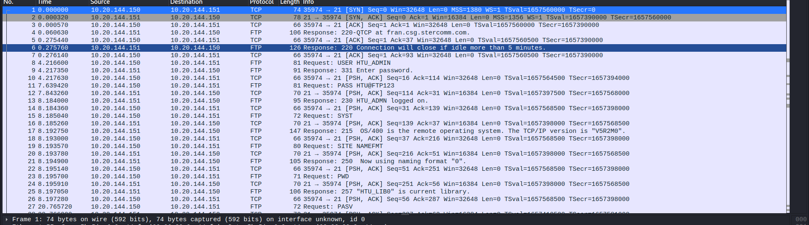
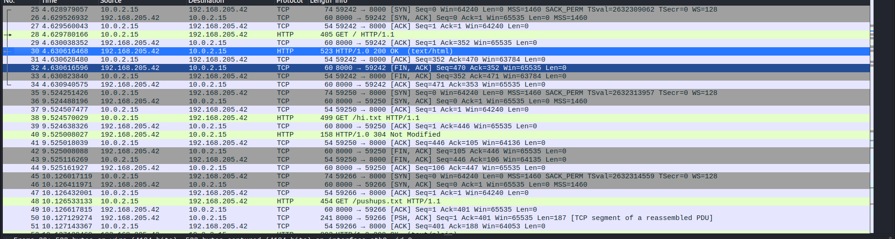
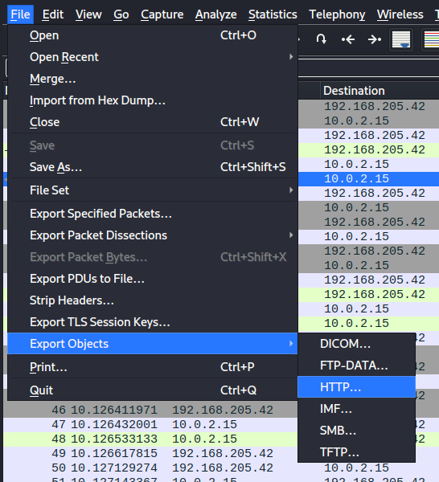
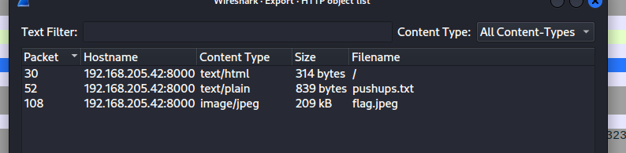
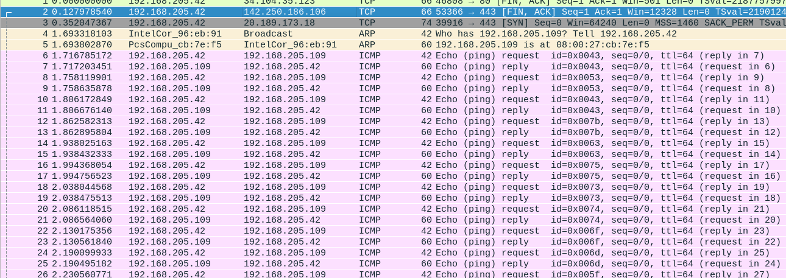
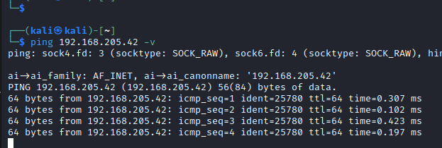
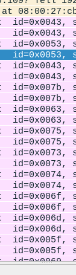

# Network Analysis

A PCAP is a file the includes captured traffic. This traffic consists of packets. These packets are from different protocols. To inspect a captured traffic, we could use a tool called **WireShark**. This tool is a GUI tool that comes with many features regarding network monitoring, but we'll only include inspecting traffic that was already captured.

Let's take a look at this challenge:


Take a look at [this](../files/challenge_wireshark/ch1/chall.pcap) file, try to figure out the FTP password of the user.

When we open the file using wireshark, we can see this



Wireshark lets us examine the packets and know what protocols they're using, they actual payloads (if in plaintext), and additional information about the protocols used. 

In this challenge, we can see some TCP packets in the beginning, but they don't show us any valuable information. We can also see FTP packets coming in and out of the server. As we know, FTP is not encrypted protocl (SFTP is), which means we can see the acutal content of the files. From examining this FTP file, we can see that the user uses the username `HTU_ADMIN`, and the password `HTU@FTP123`. 

### Exporting objects with wireshark

Wireshark also lets us extract objects that were captured. Objects can be of many kinds, such as html pages (from http plaintext traffic), FTP files, or any other files transmitted over the network.

Let's take a look at this little challenge. We have [this](../files/challenge_wireshark/ch2/chall.pcapng) pcap file. When we open it, we see some TCP, TLS, and other traffic, which is probably an encrypted traffic that doesn't have anything interesting. However, we can see some http traffic.



When scrolling down more, we can see successful http requests, which means the user was browsing a website using http. To export any objects that were trasfered using http, we can go to `File --> Export objects --> HTTP`. Of course, we can see other objects like FTP and DICOM, but that's only if FTP or DICOM traffic existed. 





We can see 3 files:

"/": This is probably the index html page on the website.

"pushups.txt": Text file, could be interesting.

"flag.jpeg": JPEG image, named "flag", which is probably the most inetersting file.

To save any file, you can click on that file, then do `save`. However, I prefer doing `save all` as you might need other files (some will have hints, etc).

When we open the index page, it's just an index page that lists directory for files, nothing interesting. When we look at the pushups.txt file, we can see stuff said about pushups, there might be some text steganography there, but let's continue our initial exploration. When we open flag.jpeg, we only see an image of a landscape, nothing interesting, but why is this image named `flag.jpeg`? It probably has somehting to do with the flag right?

The aim of this subsection was to let you know how exporting files using wireshark works. Now that we've exported those files, you have to find the flag yourself ;\)  (Use the tools we mentioned in image stegnography section).

### Yet another wireshark challenge

Sometimes challenges aren't about just one packet or another. The flag could be on multiple packets. Let's take a look at [this](./files) PCAP file, we only see ping packets (ICMP). The flag is hidden somehow.



Before I go with this challenge, you already know how to use wireshark now. I need you to inspect the PCAP file for a bit(5 mins) and try to guess how the flag is hidden.

Are you done? ok :)

You might have noticed that the ID for each ICMP packet id different. Generally speaking, the ID in almost anything in tech refers to somehting unique, and in this context, we see that the source and destination ip addresses are stable for all packets. Having a different ID for each packet is kind of suspicious. To prove that, we could send ICMP packets normally using `ping` command.



As we can see, the ID for all packets is the same. If you dig deep into the resources on the internet, you'd know that the ID is generated to be different for each ping session (there's no such thing as ping session, but let's just call it that way).

Now that we know that having different ID for each packet is not a normal behaviour, we can dig deep into the ID field of the packets so we might find somehting useful (hopefully the flag).



As we can notice, the IDs are in a friendly range (ASCII range), which means those IDS could represent letters. Note that each ID is repeated because of reply ICMP packets (1 for request and 1 for reply).

If we convert the first 5 IDs to plaintext:

```echo '43 53 43 7b 63' | xxd -r -p```

We can see that the output is `CSC{c`. THAT'S THE BEGINNING OF THE FLAG!!! Continuing with the rest of the packets, we get the flag `CSC{custom_icmp_packets_lol}`. However, taking the ID of each packet manually was kinda painful, we need something to automate this process right? that's why we need to learn how to use tshark.

# Tshark

Tshark is the CLI version of WireShark. Some poeple use it to read the packets and do analysis on them. However, I always prefer to use Wireshark first, then using Tshark for filtering. These are the commands that we'll need to use in Tshark:

Read a pcap file:
```tshark -r filename.pcap```
This will display the packets, just like in wireshark.

Filter the packets 
```tshark -r filename.pcap -Y 'icmp'```
This will only display icmp pacekts. 

To know more about filtering, you can test your filters in wireshark, the syntax of filters is the same. I'm not going to go through all filters, you can search for them on google or you can guess and try on wireshark.

Other useful filters are:
```tshark -r filename.pcap -Y 'ip.dst==127.0.0.1' # incoming traffic```
```tshark -r filename.pcap -Y 'ip.src==127.0.0.1' # outcoming traffic```
```tshark -r filename.pcap -Y 'frame.number >=10 and frame.number <=50' # Frames (you can say packets) between 10 and 50```

```tshark -r filename.pcap -Y 'http.request' # Looking for any http request```
```tshark -r filename.pcap -Y 'http.request.method == POST' # Looking for any http POST traffic, sometimes useful if passwords are included in plaintext forms```
```tshark -r filename.pcap -Y 'tcp contains "PASS"' # Searching for any tcp traffic that might include passwords in plain text```
