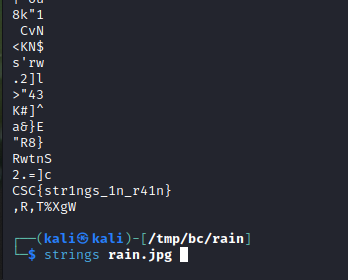
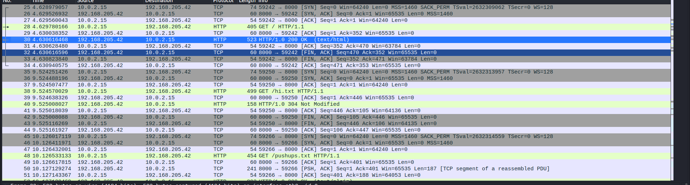

# CTF Forensics tutorial

This directory will be for the forensics CTF category training. It'll cover beginner to intermediate skills required to solve anything related to forensics challenges

## Prerequisites

Before diving into CTF, you should have some background in those:
-   Googling. You'll use google most of the time. You have to get used to doing research on different topics. (most of the time you might end up having 50 tabs open during 1 ctf challenge)
-   A programming/scripting language. Go with Python. [Python As Fast as Possible](https://www.youtube.com/watch?v=VchuKL44s6E&pp=ygULcHl0aG9uIGFzYXA%3D). To make sure you grasp that language, you could go to [CodeWars](https://www.codewars.com) where you can solve problems with your programming skills.
-   Basic networking info.
-   Dealing with linux shell and command line in general. You can go to TryHackMe Linux Fundamentals [1](https://tryhackme.com/room/linuxfundamentalspart1) [2](https://tryhackme.com/room/linuxfundamentalspart2) [3](https://tryhackme.com/room/linuxfundamentalspart3) for the very basics, then you can visit [OverTheWire Bandit](https://overthewire.org/wargames/bandit) to advance knowledge about important linux utilities that might be helpful in CTF in general.

-   Tools not installed on kali:
    apt:
    - foremost
    - steghide
    - stegseek
    - imagemagick
    
    github/other sources:
    - stegsolve:
        Copy the following box into your terminal.
        ```bash
        mkdir -p ~/bin
        wget http://www.caesum.com/handbook/Stegsolve.jar -O stegsolve.jar
        echo '#!/bin/zsh
        java -jar ~/bin/stegsolve.jar' | sudo tee /bin/stegsolve
        sudo chmod +x /bin/stegsolve
        ```


## Table of contents

-   **Some Basic info**
-   **Steganography**
    -   File type
    -   Metadata
    -   File carving/extracting
    -   strings
    -   Image steganography
    -   Audio/video steganogrphy
    -   Other forms of steganography
-   **PCAP Analysis**
    -   Wireshark
    -   Filtering data with Tshark
-   **Memory Analysis**
    -   Voliatility
    -   Where to look
    -   Dumping files, registries, hashes(cracking)
-   **Disk analysis**
    -   Autopsy


# Some Basic info

Before we start, there are some very basic stuff that might help in solving CTF challenges.

Frist of all, text encoding. Text (or data in general) can be encoded in many common ways. Knowing and making your eyes get used to those can help you find flags faster, or at least know what you're dealing with. I'm not gonna dive deep into how they are created or the math behind them, you merely need to know how they look like.

Some of the most common text encoding are as follows:
-   Hexadecimal (base16): `a-f 0-9` charcters each two characters represent 1 byte.
-   Base64: `A-Z a-z 0-9 +=` The length of a message usually is different than base64 encoding. (base64 is usually longer). However, there are many other base encodings similar to base64, like base32,45, and 62. Each one with their own character set.
-   Binary: `0 or 1`, you won't often see 0's and 1's, but you might see many binary patterns that might lead to a hint or even a flag.


For example, if we wanted to encode `CSC{do_pushups}`, it'll be as follows:
-   Hex --> `4353437b646f5f707573687570737d`
-   Base64 --> `Q1NDe2RvX3B1c2h1cHN9Cg==`
-   Binary --> `010000110101001101000011011110110110010001101111010111110111000001110101011100110110100001110101011100000111001101111101` or `abaaaabbababaabbabaaaabbabbbbabbabbaabaaabbabbbbababbbbbabbbaaaaabbbabababbbaabbabbabaaaabbbabababbbaaaaabbbaabbabbbbbab`

To encode/decode text or any form of data, there's this great tool [CyberChef](https://gchq.github.io/CyberChef/). It basically has most of encoding/encrypting methods.
Keep in mind that not everything you see encoded is a hint or something important, they could just be data itself, like image encodings in http requests.


# Steganography

Steganograhy is the field of hiding messages inside an object. Could be hiding text inside text, image, video, packets, etc.

## File type

One of the first things when you're trying to solve a steganograhpy challenge (if not the first), is to check the file type. You can check file type by:
-   Looking at the file extension if exists, but this isn't usually accurate.
-   Doing `$ file <file_name>`, which will display type of file and some additional info. This is usually accurate, but sometimes isn't correct if there's a trick.
-   Examinig the file header bytes. You can use `hexedit` or `xxd` to check the actual bytes of the header in the file. For a list of file headers (signatures), go to [List of file signatures](https://en.wikipedia.org/wiki/List_of_file_signatures). We will come to this later.
```
## TODO
Look for the tunnel vision challene in picoctf for file header thingy.
```

## Metadata

Metadata is data about data. Metadata can usually lead to hints, like GPS coordinates, comments, etc. You can get metadata by using **exiftool**.
```bash
exiftool <file>
```

## File carving/extracting

Sometimes files are hidden inside other hidden files. For example, a text file inside an image, or an image inside another image. To extract all binaries/files out of a file, we could use `binwalk`, or `foremost`. Both of them are great to extract embedded files. However, if the files embedded are password-protected, you need to know how they are embedded and see a tool to extract them.

For example, when we open this image (do right click --> save image as): 


We can see that it's just a normal image, nothing special. However, if we run `dark-landscape.jpg`. We can see the there is another image besides our original one. That image was the flag!

Keep in mind that if you run binwalk on it, it will give you the list of files, but won't extract all of them for some reason, so you could do `binwalk -e --dd=".*"` instead. `foremost` usually is fine.

## strings

The `strings` command outputs printable characters of a file to the termial. Sometimes you could find hints or flags that are hidden in plain text in an image or big files.

For example, when we do strings as in the photo, we can see that the flag is at the end of the file (sometimes in the middle of the file instead of the end). You should often use the `grep` command with this command because the output is long and it'll save your some time if you're searching for something specific.



## Image steganography

Now let's talk about hiding stuff inside images. Above, we discussed how to extract files out of an image using binwalk or foremost. However, this only works if the binary/file is inside our target image in plain-text (not encrypted/encoded/compressed). There are many other ways someone can hide stuff inside images.

### steghide

Steghide is a known tool for basic image stegnography that hides files inside an image, and encryptes them with a passphrase. You won't be able to get the files out with binwalk or foremost if they are hidden using steghide along with a passphrase (sometimes the password is blank). For example, lets see <a href="files/challenge_steghide/street.jpeg">image</a> image. If you try the previous tools on it (`binwalk`, `foremost`, `strings`) you won't find anything. But if you run `steghide --extract -sf street.jpeg` on the image, you'll be asked for a blank password. Now this one's password is `CSC_CLUB_LOL`. Now it'll extract the files hidden in street.jpg, you got the flag. However, you won't always have the password, and you can't guess the password each time, so you have to brute force it using stegseek.

### stegseek

Stegseek is a faster version of stegcracker. It's used to use [rockyou wordlist](https://github.com/brannondorsey/naive-hashcat/releases/download/data/rockyou.txt) against a file assuming that steghide has been used to hide info inside this file. For example, we can run it on <a href='files/challenge_stegseek/river.jpg'>this</a> image. Running ```stegseek river.jpg --wordlist /usr/share/wordlists/rockyou.txt``` it'll be able to extract the flag.

### LSB (Least Significat Bit)

LSB is a very simple method. It just takes each pixel of an image, and modifies the last bit of it (right-most). Why the last bit? because its value doesn't make that much difference. For example, a pixel of the rgb value of #F92121(0xF9 0x21 0x21) is modified to #F82020 where we made each LSB 0 instead of 1. 

This is done with files by taking the content of the file bit by bit, and `&`ing that bit with the LSB of the corresponding byte. However, the hidden file should have a size that is less than or equal to 1/8<sup>th</sup> of the size of the original file. For example, if we want to hide an image with the size of 100kb (100x1024 bytes --> 102400), we need a file that is at least 800kb.

You can create your own script for this, but there's [this](https://stegonline.georgeom.net/upload) tool that quite does the job. (it has additional features that we'll discuss later).


# PCAP Analysis

A PCAP is a file the includes captured traffic. This traffic consists of packets. These packets are from different protocols. To inspect a captured traffic, we could use a tool called **WireShark**. This tool is a GUI tool that comes with many features regarding network monitoring, but we'll only include inspecting traffic that was already captured.

Let's take a look at this challenge:


Take a look at [this](./files/challenge_wireshark/ch1/chall.pcap) file, try to figure out the FTP password of the user.

When we open the file using wireshark, we can see this


Wireshark lets us examine the packets and know what protocols they're using, they actual payloads (if in plaintext), and additional information about the protocols used. 

In this challenge, we can see some TCP packets in the beginning, but they don't show us any valuable information. We can also see FTP packets coming in and out of the server. As we know, FTP is not encrypted protocl (SFTP is), which means we can see the acutal content of the files. From examining this FTP file, we can see that the user uses the username `HTU_ADMIN`, and the password `HTU@FTP123`. 

### Exporting objects with wireshark

Wireshark also lets us extract objects that were captured. Objects can be of many kinds, such as html pages (from http plaintext traffic), FTP files, or any other files transmitted over the network.

Let's take a look at this little challenge. We have [this](./files/challenge_wireshark/ch2/chall.pcapng) pcap file. When we open it, we see some TCP, TLS, and other traffic, which is probably an encrypted traffic that doesn't have anything interesting. However, we can see some http traffic.



When scrolling down more, we can see successful http requests, which means the user was browsing a website using http. To export any objects that were trasfered using http, we can go to `File --> Export objects --> HTTP`. Of course, we can see other objects like FTP and DICOM, but that's only if FTP or DICOM traffic existed. 


We can see 3 files:

"/": This is probably the index html page on the website.

"pushups.txt": Text file, could be interesting.

"flag.jpeg": JPEG image, named "flag", which is probably the most inetersting file.

To save any file, you can click on that file, then do `save`. However, I prefer doing `save all` as you might need other files (some will have hints, etc).

When we open the index page, it's just an index page that lists directory for files, nothing interesting. When we look at the pushups.txt file, we can see stuff said about pushups, there might be some text steganography there, but let's continue our initial exploration. When we open flag.jpeg, we only see an image of a landscape, nothing interesting, but why is this image named `flag.jpeg`? It probably has somehting to do with the flag right?

The aim of this subsection was to let you know how exporting files using wireshark works. Now that we've exported those files, you have to find the flag yourself ;\)  (Use the tools we mentioned in image stegnography section).

### Yet another wireshark challenge

Sometimes challenges aren't about just one packet or another. The flag could be on multiple packets. Let's take a look at [this](./files) PCAP file, we only see ping packets (ICMP). The flag is hidden somehow.


Before I go with this challenge, you already know how to use wireshark now. I need you to inspect the PCAP file for a bit(5 mins) and try to guess how the flag is hidden.

Are you done? ok :)

You might have noticed that the ID for each ICMP packet id different. Generally speaking, the ID in almost anything in tech refers to somehting unique, and in this context, we see that the source and destination ip addresses are stable for all packets. Having a different ID for each packet is kind of suspicious. To prove that, we could send ICMP packets normally using `ping` command.


As we can see, the ID for all packets is the same. If you dig deep into the resources on the internet, you'd know that the ID is generated to be different for each ping session (there's no such thing as ping session, but let's just call it that way).

Now that we know that having different ID for each packet is not a normal behaviour, we can dig deep into the ID field of the packets so we might find somehting useful (hopefully the flag).


As we can notice, the IDs are in a friendly range (ASCII range), which means those IDS could represent letters. Note that each ID is repeated because of reply ICMP packets (1 for request and 1 for reply).

If we convert the first 5 IDs to plaintext:

```echo '43 53 43 7b 63' | xxd -r -p```

We can see that the output is `CSC{c`. THAT'S THE BEGINNING OF THE FLAG!!! Continuing with the rest of the packets, we get the flag `CSC{custom_icmp_packets_lol}`. However, taking the ID of each packet manually was kinda painful, we need something to automate this process right? that's why we need to learn how to use tshark.

# Tshark

Tshark is the CLI version of WireShark. Some poeple use it to read the packets and do analysis on them. However, I always prefer to use Wireshark first, then using Tshark for filtering. These are the commands that we'll need to use in Tshark:

Read a pcap file:
```tshark -r filename.pcap```
This will display the packets, just like in wireshark.

Filter the packets 
```tshark -r filename.pcap -Y 'icmp'```
This will only display icmp pacekts. 

To know more about filtering, you can test your filters in wireshark, the syntax of filters is the same. I'm not going to go through all filters, you can search for them on google or you can guess and try on wireshark.

Other useful filters are:
```tshark -r filename.pcap -Y 'ip.dst==127.0.0.1' # incoming traffic```
```tshark -r filename.pcap -Y 'ip.src==127.0.0.1' # outcoming traffic```
```tshark -r filename.pcap -Y 'frame.number >=10 and frame.number <=50' # Frames (you can say packets) between 10 and 50```

```tshark -r filename.pcap -Y 'http.request' # Looking for any http request```
```tshark -r filename.pcap -Y 'http.request.method == POST' # Looking for any http POST traffic, sometimes useful if passwords are included in plaintext forms```
```tshark -r filename.pcap -Y 'tcp contains "PASS"' # Searching for any tcp traffic that might include passwords in plain text```


... 