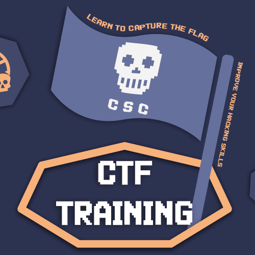

	

# Welcome to CTF Training Bootcamp

## About

We are thrilled to present an exceptional opportunity for you to fortify your digital defenses. The cyber security club is hosting a Capture The Flag (CTF) Training, designed to enroll you in the realm of cybersecurity.

We made our best to make the content beneficial, practical and simple as possible. It is like a solid reference for you in future to refer to, whenever you need a quick tutorial for certain topics.

---
## Content

**We are handing the four most popular and essential categories in CTFs:**

1. Web Exploitations.
2. Cryptography.
3. Reverse Engineering.
4. Digital Forensics.

---

## Resources & Next Step

Within each category, you will find some links and topic titles listed for you, in order to enhance your skills by diving more detailed into certain fields, as well as suggestions of possible subjects necessary  to learn for you to get to the next level in CTFs.

