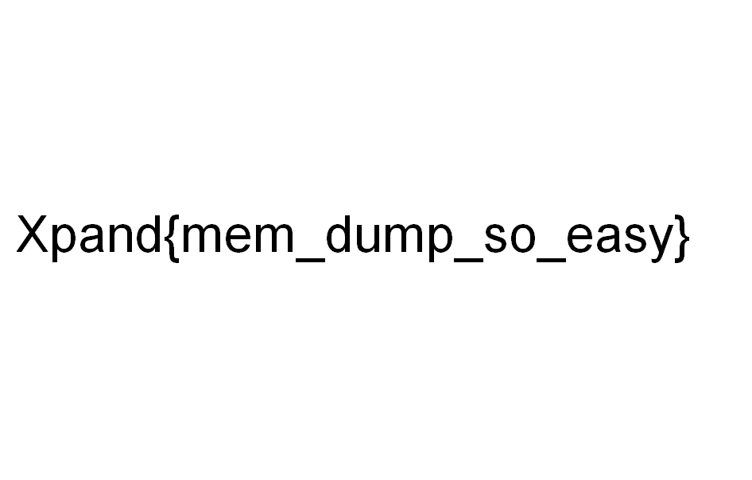
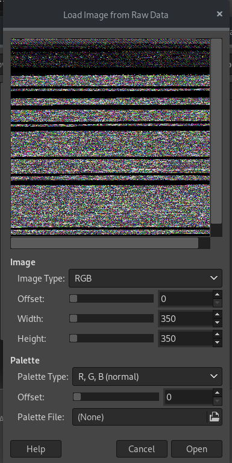
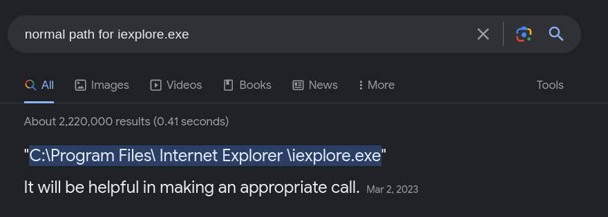

# Memory Analysis

This category will include analyzing memory dumps. As we all know, the RAM (Random Access Memory) includes many important stuff for the computer to operate, such as current running process and their information, registry values, system configurations, encrypted credentials, and many other stuff that we'll discuss. 

When an incident happens on a machine (let's say a ransomware attack), it's a good practice to save a copy of the current memory, which is called memory dump. This helps blue teamers in analyzing what happened to the machine and get useful information that might help in recovery, or even preventing similar attacks in the future.

In CTFs, there are some forensics challenges that include a memory dump, which we will try to analyze and get the flag. Mainly, the tool that we'll be using is called **Volatility**. In this section, we'll include Volatility version 2, not 3 as it's easier for now. (We'll cover volatility 3 in CSC Blue teaming path in the future).
Volatility is a very known tool for memory analysis, it comes with built-in plugins that make it easier to deep dive into the memory dump that we have.

## Volatility commands

First of all, let's download this challenge from a previous CTF that took place in Jordan Xpand  [Here](https://drive.google.com/file/d/19C3ap8Pm3jLCUTgDBjFHW5AadE_D7tws/view?usp=sharing). You'll find most memory dumps challenges compressed due to their big size. In this example, after decompressing the `core.zip`, we end up with a 1.1G file called `core.elf`, though you'll find most memory dumps end with `.dmp`, `.raw` or `vmem` extensions.

### General syntax

The general syntax for volatility is this:
```bash
volatility -f <file_name> <plugin_name> --profile=<profile_string>
```

The profile means the type of os that this memory dump was probably taken from. Volatility can determine the profile based on the dump structure and other stuff that we don't really have to get deep into. Just know that this profile is important for volatility to know how to extract information.

- **imageinfo**: This plugin shows us some information about the dump. The most important one is the profile.

So when we run this on our challenge:
```
volatility -f core.elf   imageinfo
```

We get this output (you may have to wait for some time depending on the file size):
```
Volatility Foundation Volatility Framework 2.6
INFO    : volatility.debug    : Determining profile based on KDBG search...
          Suggested Profile(s) : WinXPSP1x64, Win2003SP1x64, WinXPSP2x64, Win2003SP2x64
                     AS Layer1 : WindowsAMD64PagedMemory (Kernel AS)
                     AS Layer2 : VirtualBoxCoreDumpElf64 (Unnamed AS)
                     AS Layer3 : FileAddressSpace (/home/unknown/ctf/xpand/forensics/mem_1_and_2/core.elf)
                      PAE type : No PAE
                           DTB : 0x245000L
                          KDBG : 0xf800011afd00L
          Number of Processors : 2
     Image Type (Service Pack) : 2
                KPCR for CPU 0 : 0xfffff800011b1000L
                KPCR for CPU 1 : 0xfffffadfe446b000L
             KUSER_SHARED_DATA : 0xfffff78000000000L
           Image date and time : 2023-08-27 22:15:35 UTC+0000
     Image local date and time : 2023-08-27 15:15:35 -0700
```

We can see that the **Suggested Profile(s)** are `WinXPSP1x64, Win2003SP1x64, WinXPSP2x64, Win2003SP2x64`. Remember that volatility **suggests** those profile, os it's not always certain, but it's more likely to the the first profile (99% cases).

Now let's keep in mind that the profile is `WinXPSP1x64`, which is a Windows XP image. From now on, our commands will be like this `volatility -f ch2.dmp  --profile=WinXPSP1x64 <plugin_name>`.


Now let the games begin!

### Files

Even though some people recommend starting with processes, but I prefer to scan for files in the system. Sometimes you might find hints or files that will help you get the flag.

-   **filescan**: `volatility -f ch2.dmp --profile=WinXPSP1x64 filescan`

This will list system files for us. Some interesting directories to look in are:
-   Downloads
-   Desktop
-   Documents
-   Pictures
-   Appdata (might be usefull to get credentials sometimes)

It's better to store the output of most plugins in a text file to make it easier to read.

When we search in the desktop directory we can see the `flag.png`!

To get(dump) a file, we need two things:
-   The offset at which that file starts in the memory. In this case, `0x0000000003a5a050      1      0 R--r-- \Device\HarddiskVolume1\Documents and Settings\Administrator\Desktop\flag.PNG` --> the offset = **0x0000000003a5a050**
-   The output directory where we want to store the output.

Now let's dump that file.

-   **dumpfiles**: `volatility -f core.elf --profile=WinXPSP1x64 dumpfiles -Q 0x0000000003a5a050 -D ./outputs`. 

The **-Q** option specifies the offset of the file, and **-D** specifies the output directory, you can make it dump in the current directory, but I prefer making a seperate directory for that.

The output of the previous command is 
```Volatility Foundation Volatility Framework 2.6
DataSectionObject 0x03a5a050   None   \Device\HarddiskVolume1\Documents and Settings\Administrator\Desktop\flag.PNG
```
which means it extracted the file successfully. However, the file name will be kinda weird (file.None.0xfffffadfe6b725a0.dat), so you might want to rename it to (flag.png)

When we open the picture, it's the actual flag!



Keep in mind that this is the most simple and easy flag you could get in a memory analysis challenge.

There's another flag in the same challenge. Let's dive deep into processes now.

### Processes

Memory dumps store processes in them and information about processes, such as process ID (PID), parent PID (PPID), name of the process, etc. Let's see what plugins help us in discovering processes.

-   **psscan**: This lists the processes for us.

When running `volatility -f core.elf --profile=WinXPSP1x64 psscan`, we get [This](../files/challenge_memory/psscan.png) output

-   **pstree**: Shows the prcesses as hierarchy (which process spawned other processes and so on).
The output will be like [This](../files/challenge_memory/pstree.png)

This helps us identify some malware-like behaviours.

-   **psxview**: This will also list processes, but will try to look for hidden processes. See [here](../files/challenge_memory/psxview.png)

Now after we got the processes, we do one of those things:
1. Try to look for some common processes names (notepad, mspaint, iexplorer, etc). We might extract good information from those processes.

2. Look for any suspicious names or behaviours from the processes, such as a cmd spawning from a Word document (.docx).

3. Dump the files and examine them on our machine, extract binaries/information from those files, reverse engineer the binary files, try to render the process itself using Gimp if possible.

For this challenge, we can see that mspaint.exe is open, which means the user might have been drawing something. In order to examine that process, we dump it using **memdump** command:


```volatility -f core.elf --profile=WinXPSP1x64  memdump -p 1076 -D .```

Note: There's another command called **procdump**, but it only dumps the actuale executable part of the process, while **memdump** dumps everything related to the process that was present in the memory, which is what we want. Sometimes you need **procdump** if you want to analyze a malware executable etself (reverse engineering). 

We can see that the output file is `executable.1076.exe`. Now there's a very common trick for MS Paint used in CTF forensics, which is rendering what the user was drawing. That could be done using **Gimp**.

The steps are as follows:

1. Rename `1076.dmp` to `1076.data` (or copy it). The name doesn't matter, but the extension does.

2. Open Gimp. Press File --> Open, then select `1076.data`. This will make gimp tree the process as a raw image thinking that each byte represents a pixel.



3. Now the pixels are pretty random. There are many things we can play with:

     -    The image Type: This will change the way that gimp renders the image depending on the structure of bytes. The correct image type will often be **RGB Alpha**.
     -    Offset: This will determine from which offset gimp will start rendering. Try to increase it until you see something that might be valuable (no criteria here).
     -    Width and height: I advice to increase the width so it's more than the height to help simulate the original picture.

If there's anything written on mspaint, it'll be mirror horizontally, just keep that in mind.

The flag is `Xpand{N0T_TH4T_34SY}`

### Investigating command line behaviours

It's very common for most malicious programs to spawn a CMD. To see what CMD commands were used, we can use those two:

-    **cmdline**: This will show every command that has been executed from the CMD (by the user or by a process)

-    **consoles**: This will also show some commands, but usually the ones that are unfamiliar or suspicious.

For exmaple, let's take a look at this challenge from **Root ME**. You can download the memory dump [here](challenge01.root-me.org/forensic/ch2/ch2.tbz2)

The challenge has many levels, all about the same memory dump. On level 3, it asks for the md5sum of the full path of the malicious executable file.

Now from what we've learnt, we need to know which processes were there and we should inspect them. Running `pstree` will give use a big tree of processes. Take a good look at it, and try to find a suspicous pattern (if exists). Note that you might not be familiar with all of windows processes names, so feel free to google whatever you want.

After taking an in-depth look at the process tree, we can see that there's a cmd process coming out of internet explorer.

```
 0x87ac6030:explorer.exe                             2548   2484
. 0x87b6b030:iexplore.exe                            2772   2548
.. 0x89898030:cmd.exe                                1616   2772
```

CMD doesn't spawn from Internet Explorer, so there has to be something there. if we take a look at the internet explorer process with PID of 2772 in the cmdline output, we can see that the path for that file is `C:\Users\John Doe\AppData\Roaming\Microsoft\Internet Explorer\Quick Launch\iexplore.exe`.

However, if we look up "Normal path for iexplore.exe":



Hence, this is the malicous executable that we're looking for. Notice how it is a smart move to put it in the Quick Launch folder as the user will think it's the legitimate internet explorer.

The md5sum of the path is `49979149632639432397b3a1df8cb43d`, which should be the flag in this case.


### Dumping other useful information

Sometimes the challenge isn't asking for a flag, sometimes it's just about real artifacts from the machine. Let's take a look at what volatility can do for us.

-    **hashdump**: This plugin will dump the ntlm hashes. Those hashes are for the users passwords on windows. Sometimes you're asked to find the password of a certain user, and cracking those hashes will be a useful thing to do.

For example, from the previous challenge, we can run the command `volatility -f core.elf --profile=WinXPSP1x64 hashdump`, and it'll output this:

```
Administrator:500:a46139feaaf2b9f117306d272a9441bb:6597d9fe8469e21d840e2cbff8d43c8b:::
Guest:501:aad3b435b51404eeaad3b435b51404ee:31d6cfe0d16ae931b73c59d7e0c089c0:::
SUPPORT_388945a0:1001:aad3b435b51404eeaad3b435b51404ee:2f5e748f4208fdac06e2ed1b1074a72e:::
```
We can crack those using john. If you put them in a file (hashes.txt), and run `john hashes.txt --wordlist=/usr/share/wordlists/rockyou.txt`, you'll recieve this output:
```
                 (Guest)     
CHANGEM          (Administrator:1)     
E                (Administrator:2)
```
This means that the password for user Guest is an empty password, and the password for Admin is a partial password (you can look that up).

#### Important NTLM hashes info

The NTLM hash includes those parts: username, relative identifier (like UID), LM hash, NT hash. A lot of times you'll see "aad3b435b51404eeaad3b435b51404ee" as the LM hash, which means that the LM hash was not used (empty). In this case, you'll have to crack the NT hash (second part), not the whole hash. 

Trying john on the whole hash won't always get you results, so if that happens, try john on the NT hash alone and see if you could get it. Also you could use crackstation.


-    **envars**: This command shows us the environment variables. Sometimes CTFs include questions about the OS such as computer name, computer architecture, etc.

-    **netscan**: Network connecitons established, what processes established them, local and foreign address, and so on. 


